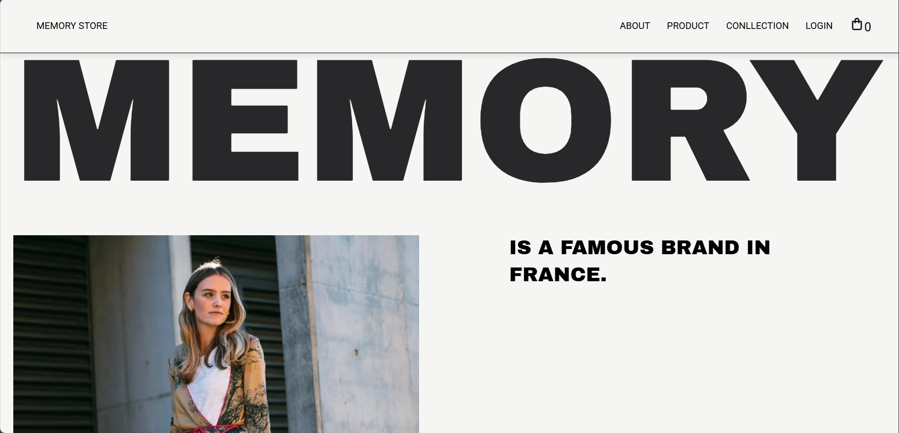
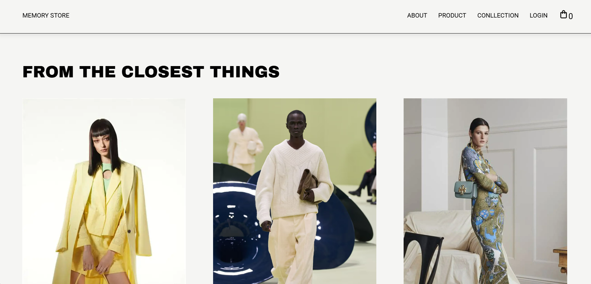
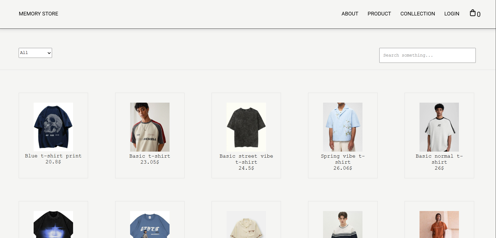
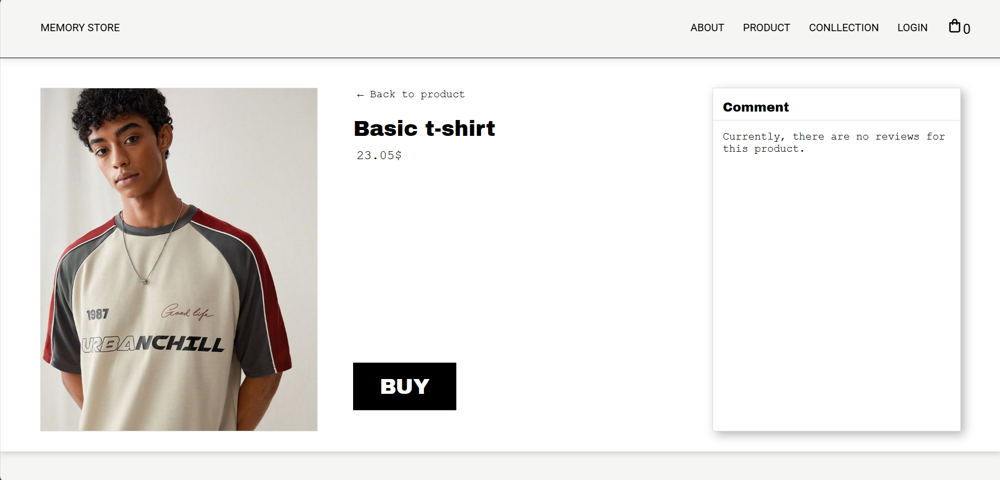
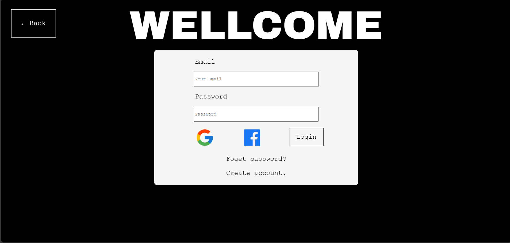
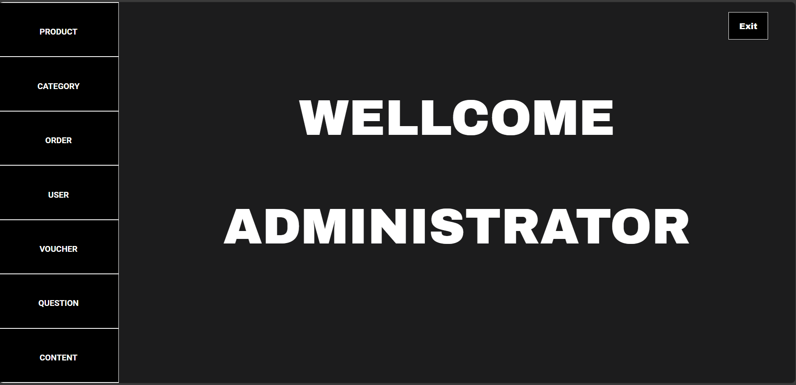
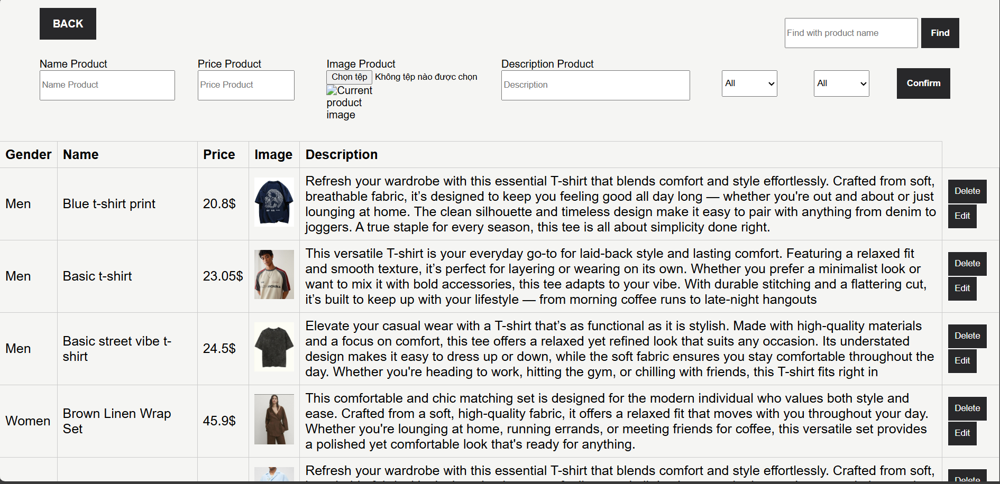
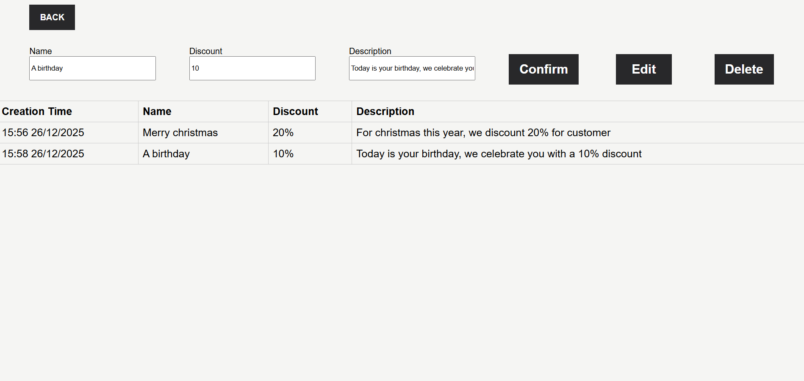

# Fashion Shop

## 1. Introduction

**Fashion Shop** is a comprehensive **Full-stack E-commerce Solution** designed to optimize online fashion retail operations.

The project is built on **RESTful API** architecture, featuring robust Backend logic and a Frontend strictly separated for two distinct user groups:
* **Customers (End-users):** A seamless shopping experience ranging from product search and cart management to online ordering.
* **Administrators (Admins):** A powerful Dashboard for product management, order tracking, and website content control.

The project focuses on handling complex Backend tasks such as **Authentication (JWT)**, **Media Storage (Cloudinary)**, and **Database Optimization (MongoDB)**.

**Demo:** [https://fashion-bsqk.onrender.com](https://fashion-bsqk.onrender.com)

> ⚠️ **Note:** The server is deployed on the **Render Free Tier**. If you experience slow loading (approx. 30-50s) on your first visit, please wait patiently while the server wakes up from sleeping mode. Videos and images may load slower than usual due to bandwidth limitations.

## 2. Key Features

### User Module (Customer)
* **Account Authentication:** Register, Login, Forgot Password.
* **Shopping & Products:**
    * Search and Filter products by category.
    * View product details.
    * Add to cart, update quantity.
    * Apply discount codes (Vouchers).
    * Checkout (Process simulation).
* **Interaction:** Send inquiries/questions to the store.

### Admin Module (Administrator)
* **Admin Login:** Separate, highly secure interface.
* **Product Management:**
    * Add, edit, delete products.
    * **Cloudinary Integration:** Direct upload of images/videos to the cloud.
* **Content Management (CMS):** Manage banners, images, videos, and blog posts.
* **Business Management:**
    * Manage product categories.
    * Manage order status.
    * Manage discount codes (Vouchers).
    * Reply to customer inquiries.

## 3. Tech Stack

  
 
  

### Frontend
* **HTML5 / CSS3 / JavaScript:** Building user interface and client-side logic.
* **Responsive Design:** Optimized display across various devices.

### Backend
* **Node.js:** Server-side JavaScript runtime environment.
* **Express.js:** Web framework for building RESTful APIs and routing.

### Database & Cloud
* **MongoDB:** NoSQL database, using **Mongoose** (ODM) for data interaction.
* **Cloudinary:** Cloud storage service for images and videos.

### Libraries & Utilities
* **Security:** JWT (Authorization), Bcrypt (Password hashing), CORS.
* **Utilities:** Multer (File upload), Dotenv (Environment variables).

## 4. Database Schema
* **Users / Admin:** Stores account information, passwords (hashed).
* **Product:** Product details, linked to Category ID.
* **Category:** Product categories.
* **Cart:** Shopping cart (Linked to User ID, Product ID).
* **Order:** Orders (Linked to User, Product, Voucher).
* **Voucher:** Discount codes.
* **Page / Content:** Website content (Banners, Videos, Articles).
* **Question:** Customer inquiries.

## 5. Installation

Follow the steps below to run the project locally.

### 1. Prerequisites
* [Node.js](https://nodejs.org/) (v14 or higher)
* [MongoDB](https://www.mongodb.com/) (Atlas or Local)
* [Cloudinary](https://cloudinary.com/) Account

### 2. Setup

**Step 1: Clone the repository**
* git clone [https://github.com/huynhnhut552004/fashion.git](https://github.com/huynhnhut552004/fashion.git)
cd fashion

**Step 2: Install dependencies**
* npm install

**Step 3: Configure environment variables**
* Create a .env file in the root directory and fill in your details:
    * MONGO_URL=mongodb+srv://<username>:<password>@...
    * JWT_SECRET=your_secret_key
    * CLOUDINARY_CLOUD_NAME=your_name
    * CLOUDINARY_API_KEY=your_key
    ** CLOUDINARY_API_SECRET=your_secret
    * PORT=3000

**Step 4: Run the project**
* npm start
* Access the app at: http://localhost:3000.

## 6. API Documentation
Below are some of the system's key endpoints. For detailed documentation, please refer to the source code or the Postman Collection.

| Chức năng | Method | Endpoint | Description |
| :--- | :---: | :--- | :--- |
| **Auth** | POST | `/Login` | User login (Returns Token) |
| **Product** | GET | `/Product` | Get a list of all products |
| **Product** | GET | `/Product/:id` | View product details |
| **Order** | POST | `/Order` | Create a new order (Checkout) |
| **Admin** | POST | `/imgProduct` | Upload product images to Cloudinary |

## 7. Screenshots
| Home | Collection |
|:---:|:---:|
|  |  |

| Product | Detail product |
|:---:|:---:|
|  |  |

| Login | Admin Main |
|:---:|:---:|
|  |  |

| Product admin | Voucher admin |
|:---:|:---:|
|  |  |

## 8. Author & Contact
* Huỳnh Minh Nhựt
* Email: nhut552004@gmail.com
* Portfolio: https://portfolio-1f96c.web.app