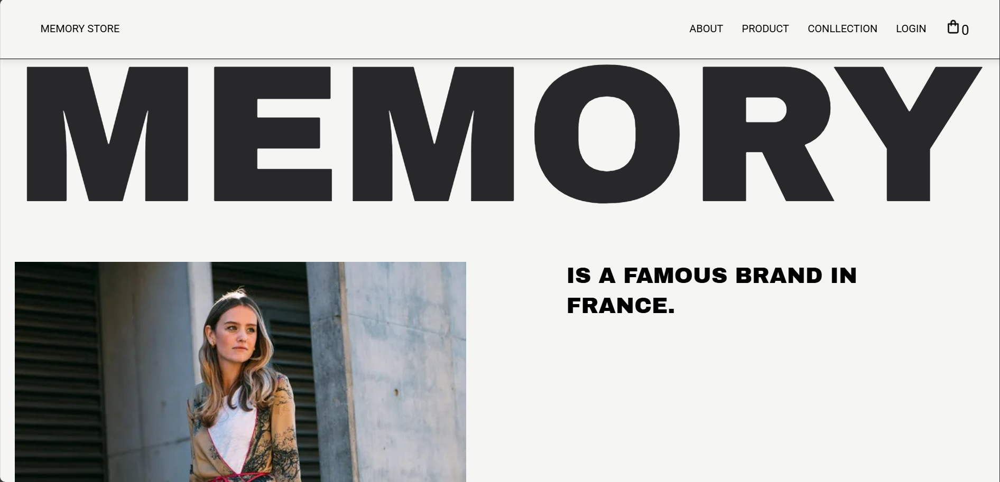
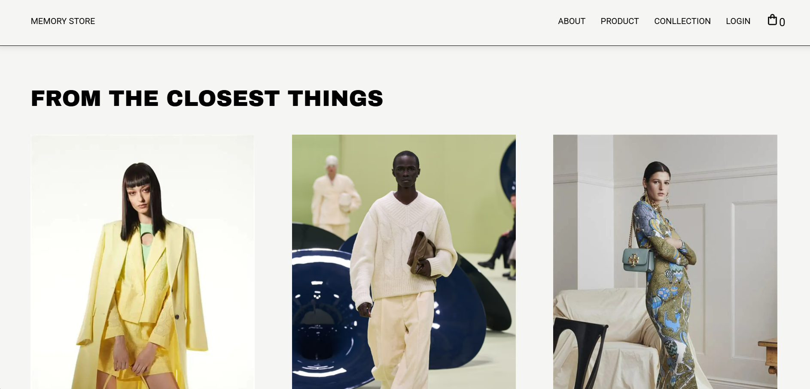
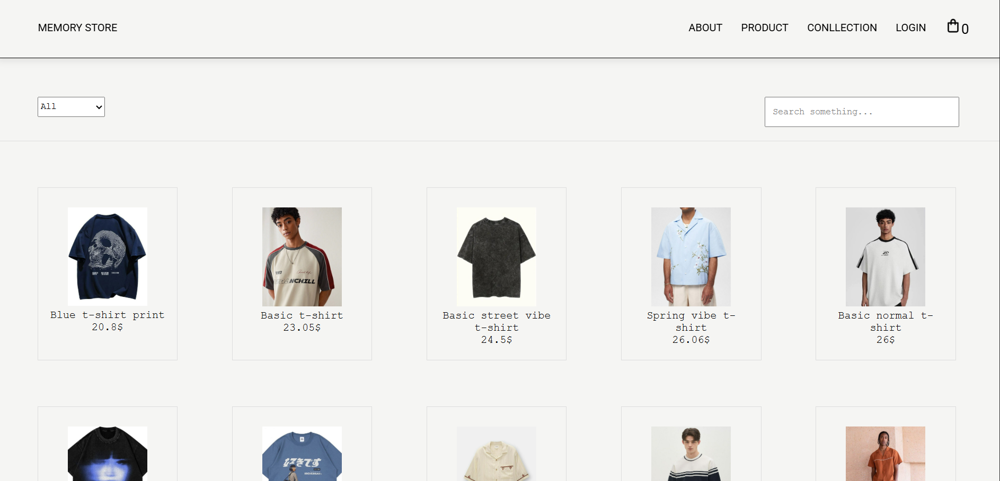
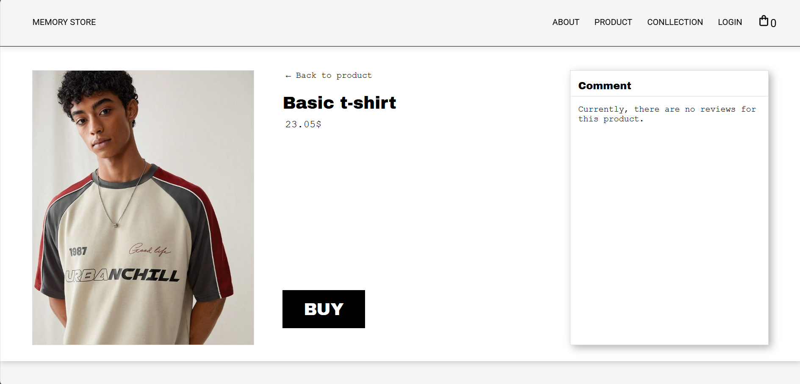
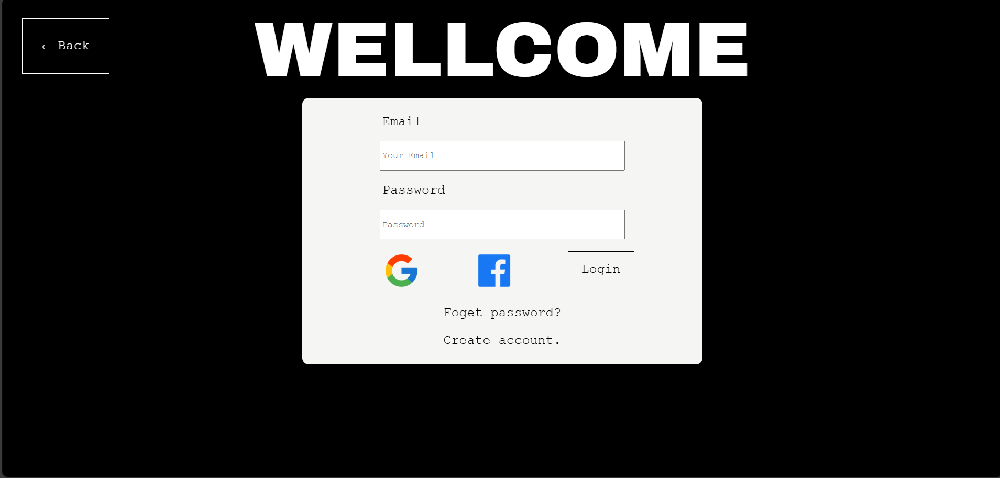
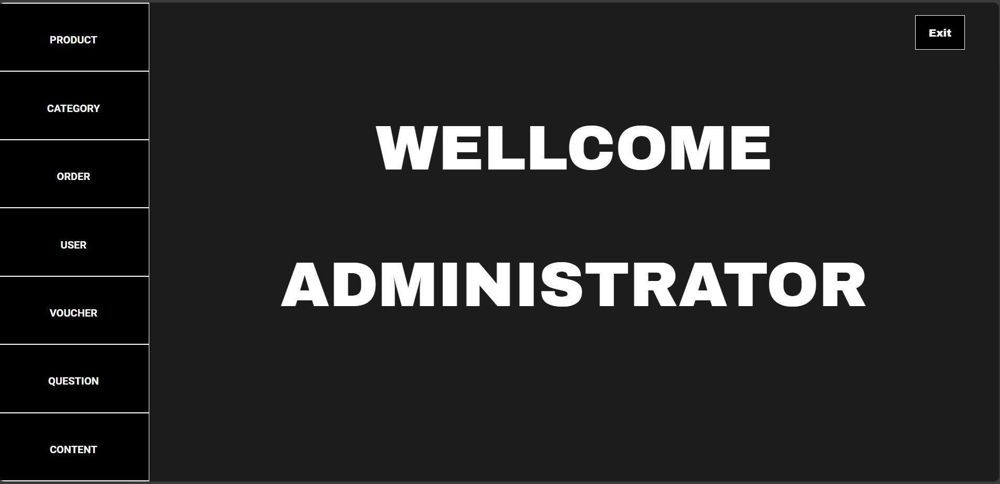
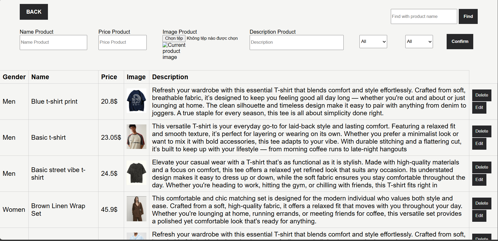
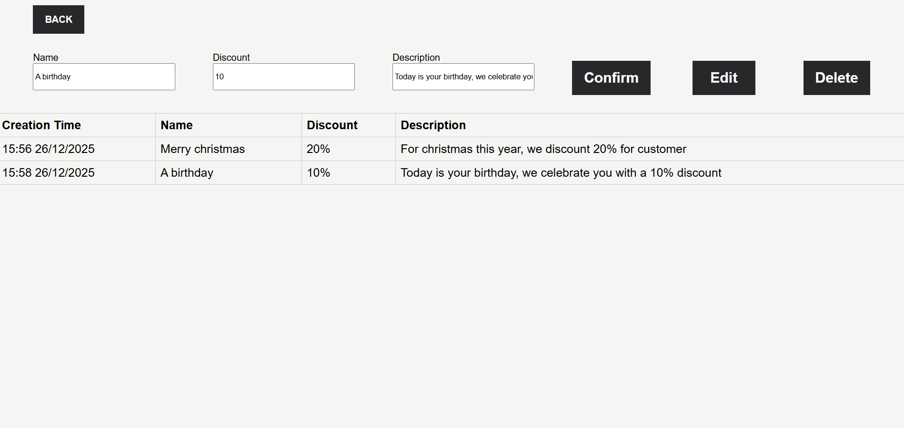

# Fashion Shop

A full-stack e-commerce website for fashion products, built with Node.js, Express.js and MongoDB.

## Overview

**Fashion Shop** is a full-stack e-commerce project that provides separate experiences for customers and administrators.

The project was developed as an earlier web development project to practice building a complete e-commerce system, including authentication, product management, shopping cart, order processing, vouchers, media upload and content management.

### Demo

**Live Demo:** https://fashion-bsqk.onrender.com

> **Note:** The backend is deployed on Render Free Tier. The server may take around 30–50 seconds to respond on the first request after being inactive. Images and videos may also load more slowly due to hosting and bandwidth limitations.

---

## Features

### Customer

* Register and login
* Forgot password
* Browse products
* Search and filter products by category
* View product details
* Add products to cart
* Update cart quantities
* Apply discount vouchers
* Place orders
* Submit questions to the store

### Administrator

* Separate administrator authentication
* Product management

  * Create products
  * Update products
  * Delete products
  * Upload product images/videos
* Category management
* Order management
* Voucher management
* Website content management

  * Banners
  * Images
  * Videos
  * Articles
* Manage customer questions

---

## Technical Highlights

Some of the main technical areas implemented in this project:

* **Authentication & Authorization**

  * JWT-based authentication
  * Password hashing with Bcrypt
  * Separate user and administrator access

* **RESTful API**

  * Backend API built with Express.js
  * CRUD operations for products, categories, vouchers and content

* **Media Management**

  * Image and video upload with Multer
  * Cloudinary integration for cloud media storage

* **Database**

  * MongoDB with Mongoose
  * Relationships between users, products, categories, carts, orders and vouchers

* **Responsive UI**

  * Responsive layouts for desktop and mobile devices

---

## Tech Stack

### Frontend

* HTML5
* CSS3
* JavaScript

### Backend

* Node.js
* Express.js
* JWT
* Bcrypt
* Multer
* CORS
* Dotenv

### Database & Services

* MongoDB
* Mongoose
* Cloudinary

---

## Project Structure

```text
Fashion Shop/
├── Backend/
│   ├── controllers/
│   ├── models/
│   ├── routes/
│   ├── middleware/
│   └── ...
│
├── Frontend/
│   ├── css/
│   ├── js/
│   ├── pages/
│   └── ...
│
├── Img_Demo/
└── README.md
```

> The exact structure may vary depending on the version of the project.

---

## Database Models

The application uses MongoDB with Mongoose.

| Model            | Description                                      |
| ---------------- | ------------------------------------------------ |
| `User`           | Customer and administrator accounts              |
| `Product`        | Product information and category reference       |
| `Category`       | Product categories                               |
| `Cart`           | Shopping cart associated with users and products |
| `Order`          | Customer orders and purchased products           |
| `Voucher`        | Discount codes                                   |
| `Page / Content` | Website banners, videos and articles             |
| `Question`       | Customer questions and inquiries                 |

---

## Installation

### Requirements

* Node.js 14+
* MongoDB Atlas or local MongoDB
* Cloudinary account

### 1. Clone the repository

```bash
git clone https://github.com/huynhnhut552004/fashion.git
cd fashion
```

### 2. Install dependencies

```bash
npm install
```

### 3. Configure environment variables

Create a `.env` file and configure the required environment variables:

```env
MONGO_URL=mongodb+srv://<username>:<password>@...
JWT_SECRET=your_secret_key

CLOUDINARY_CLOUD_NAME=your_cloud_name
CLOUDINARY_API_KEY=your_api_key
CLOUDINARY_API_SECRET=your_api_secret

PORT=3000
```

### 4. Start the application

```bash
npm start
```

Then open:

```text
http://localhost:3000
```

---

## API Overview

The backend exposes RESTful endpoints for authentication, products, orders and administration.

| Feature        | Method | Endpoint       | Description          |
| -------------- | :----: | -------------- | -------------------- |
| Authentication |  POST  | `/Login`       | Authenticate a user  |
| Products       |   GET  | `/Product`     | Get all products     |
| Products       |   GET  | `/Product/:id` | Get product details  |
| Orders         |  POST  | `/Order`       | Create a new order   |
| Admin          |  POST  | `/imgProduct`  | Upload product media |

For the complete API implementation, see the backend source code.

---

## Screenshots

### Customer

|                     Home                    |                   Collection                  |
| :-----------------------------------------: | :-------------------------------------------: |
|  |  |

|                    Product                    |                 Product Detail                |
| :-------------------------------------------: | :-------------------------------------------: |
|  |  |

### Authentication & Administration

|                     Login                     |                Admin Dashboard                |
| :-------------------------------------------: | :-------------------------------------------: |
|  |  |

|               Product Management              |               Voucher Management              |
| :-------------------------------------------: | :-------------------------------------------: |
|  |  |

---

## Project Status

This is an **older project** developed as part of my web development learning process.

The project is kept as a reference for my earlier experience with full-stack web development, RESTful APIs, authentication, database design and third-party services.

---

## Author

**Huỳnh Minh Nhựt**

* Email: [nhut552004@gmail.com](mailto:nhut552004@gmail.com)
* Portfolio: https://portfolio-1f96c.web.app
